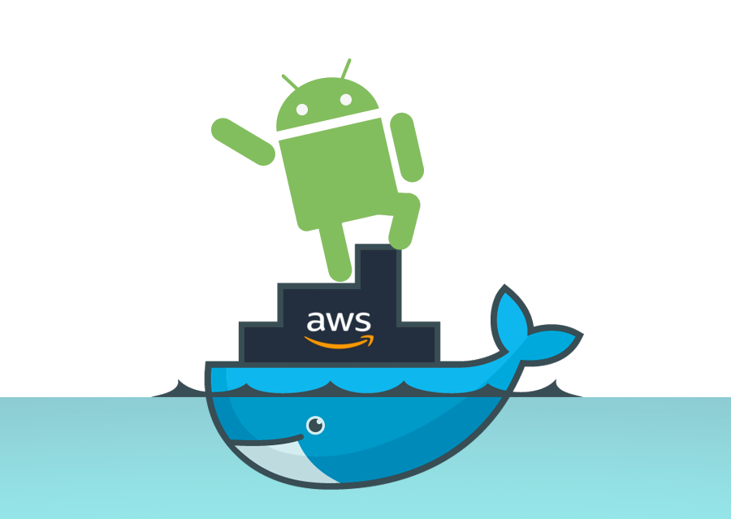

# android-build-environment

<p align="center">
  
</p>

[](https://dev.azure.com/luislopezruiz/android-build-environment/_build/latest?definitionId=1&branchName=master)

[](LICENSE)
[](https://github.com/RichardLitt/standard-readme)

> Docker image for build android images. AWS integration. For android build and delivery automation. :whale:

This image can **build** and **deliver** an Android App to the **alpha phase**, manage some AWS OPS with the AWSCLI pre-installed, only some environments variables are needed to be defined.

## Table of Contents

- [Security](#security)
- [Background](#background)
- [Usage](#usage)
- [Contributing](#contributing)
- [License](#license)

## Security

Any sensible information is handled by environment variables, you don't need to define passwords in the run script.

Also it's recommended that you create a special credentials for AWS (Programatic User with only specific permissions) and Google Play user for APK uploading (Only upload permission to alpha phase).

## Background

### Image

An ubuntu 18.04 image is used. Is easier to manage and clean. :floppy_disk:

### Pre-installed tools

- AWSCLI :computer:
- Android SDK tools build version 4333796 :iphone:
- Python :hammer:
- Python PIP :wrench:
- Basic Upload Script for APK's :scroll:

## Usage

Before running the image check the run script, this script is fundamental to make an Android build and delivery.

Inside this script you can specify the steps to build and deliver the image.

[run.sh](run.sh)

---

You may start the image with some environment variables.

Also you need to link your code to the docker container as a volume to the path /android-project/source.

``` bash
docker run \
--rm \
-d \
-v /path/to/project:/android-project/source \
--env AWS_ACCESS_KEY_ID=XXXXXXXXXXXX \
--env AWS_SECRET_ACCESS_KEY=XXXXXXXXXXXXX \
--env KEYSTORE=./ks.keystore \
--env STOREALIAS=somealias \
--env STOREPASS=XXXXXXX \
--env GPLAYKEY=./gkey.p12 \
blueseph28/android-build-environment
```

### Environment Variables

#### AWS_ACCESS_KEY_ID

> AWS access key

#### AWS_SECRET_ACCESS_KEY

> AWS secret access key

#### AWS_DEFAULT_REGION

> **OPTIONAL** default region for AWS commands if not specified will be used North Virginia

#### KEYSTORE

> Path to keystore

#### STOREALIAS

> Alias of the keystore

#### STOREPASS

> Password of the keystore

#### GPLAYKEY

> Path to the P12 Key for the access to upload your APK

## Contributing

Pull Requests are accepted! :octocat:

basic_upload_apks_service_account.py extracted from other project.

[APK's upload script](https://gist.github.com/machinekoder/6ab0c25c8afae600e2ecd24282aed4bc)

## License

[MIT License](LICENSE)
